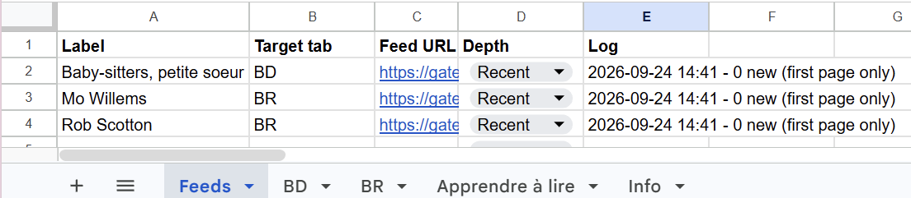

# tpl-tools

## yaz

Builds and runs a docker container which opens a connection to the Toronto Public Library catalogue as described at https://open.toronto.ca/dataset/z39-50-library-catalogue/ .  
Yaz client source files are taken from https://ftp.indexdata.com/pub/yaz/ .  

This is an example of running the container, performing a search for a keyword "docker", displaying the first item of the result set, and closing the connection.    

## tpl-update-feeds 
### Why this exists
I am often interested whether my library has purchased any new titles in a certain category. For example, a new book by a favourite author or a new book in a favourite series. 

The implementation options that I rejected:
- checking manually (repetitive and time consuming, obviously),
- checking automatically using browser emulation like Playwright (very heavy for the task of gathering several lists),
- checking using an LLM with web access (when possible, I prefer to have a deterministic solution that I control end-to-end, that works best for lookup-type tasks, and that does not spend tokens at each invocation).

This is a proposed solution:
1. BiblioCommons (the library's frontend) exposes a RSS feed for a search result, which makes it the best source of data. This is what RSS is made for and it is very lightweight. The RSS feed encapsulates all the parameters of the search, including Date Acquired which creates a pretty stable sort order. The record ID exposed in a RSS feed can serve as a reliable unique identifier for the books.  
2. Google Sheets is used as a database + UI. This is arguably the easiest option to store small data and provide an immediate user interface to read and edit the data. 
3. Google Apps Script works as a pipeline that parses RSS feeds for specified categories, performs a lookup against existing data, and adds new titles into the booklists. The new entries are inserted at the top of the list, maintaining the sorting order which starts from the recently acquired titles. 
4. For every RSS feed there are two depth options: all RSS pages ('Full') and the first RSS page only ('First'). The former mode is used for an initial download of titles in a category, and the latter mode is used when looking up recent updates for existing lists. 

### How to use
A worksheet should have a dedicated tab called 'Feeds' that is used to configure the pipelines. All other tabs can represent groupings of lists (for example, by genre).  

The 'Feeds' tab should have columns:
- Label
- Target tab
- Feed URL
- Depth
- Log

Individual tabs should have columns:
- Label
- Link
- Date found

New booklists are added by adding a new row into the 'Feeds' table. 
The download is triggered by choosing 'Library - Check feeds now' in the menu. 

For example, before checking the feeds:

After checking the feeds:

New additions are highlighted so that the user could review the changes. 

### Setup 

See [INSTALL.md](tpl-update-feeds/INSTALL.md)