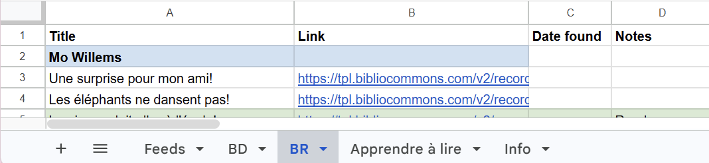
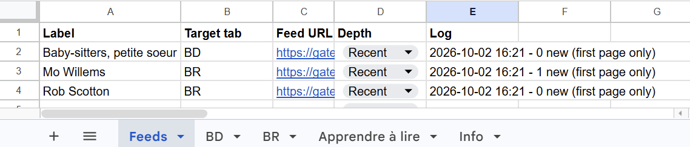
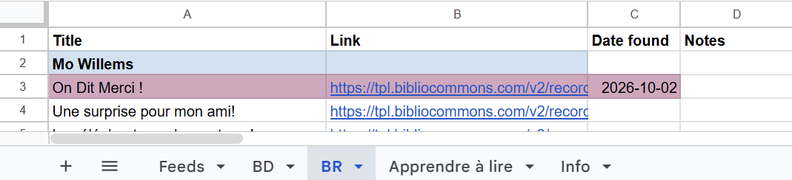

# tpl-tools

## yaz

Builds and runs a docker container which opens a connection to the Toronto Public Library catalogue as described at https://open.toronto.ca/dataset/z39-50-library-catalogue/ .  
Yaz client source files are taken from https://ftp.indexdata.com/pub/yaz/ .  

This is an example of running the container, performing a search for a keyword "docker", displaying the first item of the result set, and closing the connection.    
  

## tpl-update-feeds 
### Why this exists
I am often interested whether my library has purchased any new titles in a certain category. For example, a new book by a favourite author or a new book in a favourite series.  

The implementation options that I rejected:
- checking manually (repetitive and time consuming, obviously),
- checking automatically using browser emulation like Playwright (very heavy for the task of gathering several lists),
- checking using an LLM with web access (when possible, I prefer to have a deterministic solution that I control end-to-end, that works best for lookup-type tasks, and that does not spend tokens at each invocation).

This is a proposed solution:
1. BiblioCommons (the library's frontend) exposes a RSS feed for a search result, which makes it the best source of data. This is what RSS is made for and it is very lightweight. The RSS feed encapsulates all the parameters of the search, including Date Acquired which creates a pretty stable sort order. The record ID exposed in a RSS feed can serve as a reliable unique identifier for the books.  
2. Google Sheets is used as a database + UI. This is arguably the easiest option to store small data and provide an immediate user interface to read and edit the data. 
3. Google Apps Script works as a pipeline that parses RSS feeds for specified categories, performs a lookup against existing data, and adds new titles into the booklists. The new entries are inserted at the top of the list, maintaining the sorting order which starts from the recently acquired titles. 
4. For every RSS feed there are three depth options: all RSS pages ('Full', up to 36 pages), the first RSS page only ('Recent'), and no download ('None'). 'Full' is used for an initial download of titles in a category, 'Recent' is used when looking up recent updates for existing lists, and 'None' keeps a feed configured but switches it off. 

### How to use
A worksheet should have a dedicated tab called 'Feeds' that is used to configure the pipelines. All other tabs can represent groupings of lists (for example, by genre).  

The 'Feeds' tab should have a header row with columns (in any order, matched by header name):
- Label - the name of the list (an author, a series, ...); it must match a heading row on the target tab
- Target tab - the name of the tab where the list lives
- Feed URL - the BiblioCommons RSS feed
- Depth - Full, Recent or None (an empty cell is treated as None)
- Log - filled in by the script

Individual (target) tabs should have a header row (row 1) with columns (in any order, matched by header name, case-sensitive):
- Title
- Description
- Author
- Link
- Date found
- Publication Date

Each list on a target tab starts with a heading row: the Title cell holds the Label from the 'Feeds' tab and the Link cell is empty. New titles are inserted directly under that heading row. A heading must appear exactly once per tab. A book is considered known when its record ID is found in the Link column.  

If the target tab has no heading row for a label, the script creates one at the bottom of the tab, below everything already there, when it has at least one new title to add. Only the Title cell is filled and no formatting is applied to the heading. To place a list elsewhere, add the heading row by hand before the first run.  

New booklists are added by adding a new row into the 'Feeds' table.  
The download is triggered by choosing 'Library - Check feeds now' in the menu.  

While a run is going on, the Log cell of every feed shows 'queued' and is replaced with the result as each feed is processed. The result is either the number of new titles (with a note such as 'heading created' or 'first page only') or an error message, for example an HTTP error from the feed or a missing target tab. If another run is already in progress, an alert is shown and nothing is started. Problems with the 'Feeds' tab itself (missing tab, missing column, no feed rows) are also shown as an alert.  

What is stored for each newly added title:
- Title - the <title>, followed by : and the <subtitle> when there is one
- Description - the <description> text
- Author - the <dc:creator> values; when there are several, they are joined with ; 
- Link - the record link
- Date found - the date of the run
- Publication Date - the date part of <pubDate>, taken as written in the feed. It is left empty when the value is not a valid date. This is the publication date of the book, not the date the library acquired it (the feed does not expose the acquisition date, although the feed's sort order is based on it).

Existing rows are never updated.  

For example, before checking the feeds:

  

  

After checking the feeds:

  

  

New additions are highlighted so that the user could review the changes.  

### Setup 

See [INSTALL.md](tpl-update-feeds/INSTALL.md)  