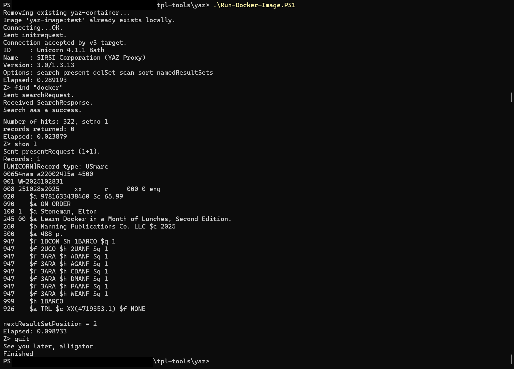

# tpl-tools

## yaz

Builds and runs a docker container which opens a connection to the Toronto Public Library catalogue as described at https://open.toronto.ca/dataset/z39-50-library-catalogue/ .  
Yaz client source files are taken from https://ftp.indexdata.com/pub/yaz/ .  
